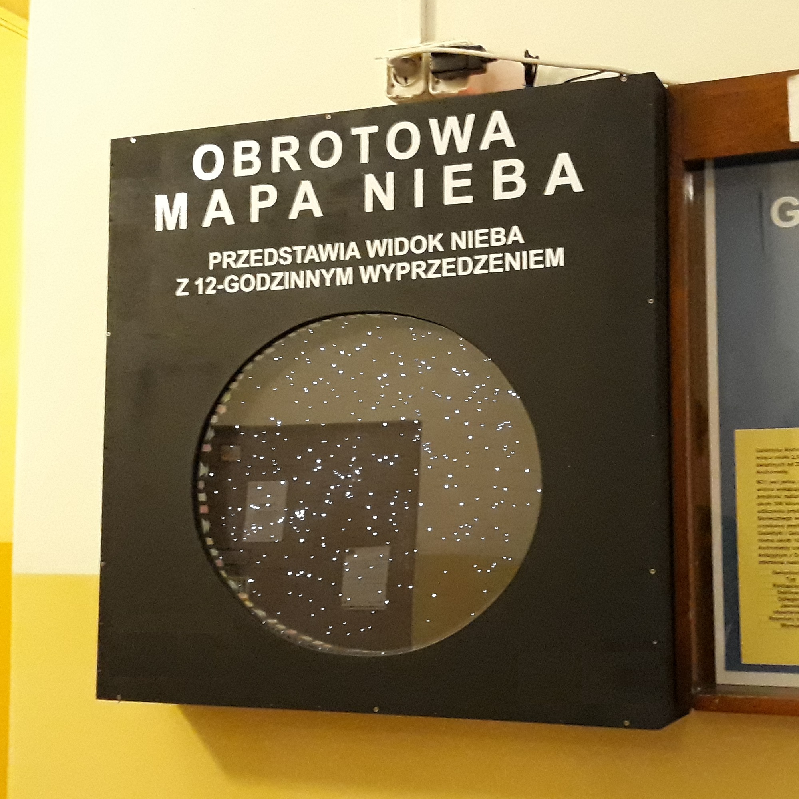

# Sky Map - Obrotowa mapa nieba

A map of night sky rotating in real time. Uses [DCF77](https://en.wikipedia.org/wiki/DCF77) time signal for synchronization. Once it's turned on, it works fully automatically and doesn't require any configuration. Since this is a school project, the documentation is written in Polish.

Obrotowa mapa nieba przedstawia wygląd nocnego nieba z 12-godzinnym wyprzedzeniem na podstawie daty i godziny odebranej z nadajnika [DCF77](https://en.wikipedia.org/wiki/DCF77). Urządzenie z założenia ma być autonomiczne i ma nie wymagać jakiejkolwiek ręcznej konfiguracji.

## Budowa

Wewnątrz obudowy znajduje się tarcza, która opiera się na dwóch kołach zębatych wydrukowanych w 3D. Jedno z nich jest napędzane przez silnik krokowy.

Obwód elektroniczny składa się z mikrokontrolera AVR ATtiny2313, modułu odbiornika sygnału DCF77, układu ULN2803 sterującego silnikiem krokowym oraz czujnika optycznego, dzięki któremu możliwe jest ustalenie położenia tarczy po włączeniu zasilania.

## Program

Mikrokontroler odbiera sygnał z modułu DCF77 i przekształca go na liczbę minut od 00:00 01.01.2000. Na tej podstawie oblicza żądany kąt ustawienia tarczy `desired_angle`, który jest inkrementowany co odpowiedni czas. Tarcza obraca się dopóki aktualny kąt `current_angle` jest różny od `desired_angle`.

Kąt jest obliczany na podstawie faktu, że w ciągu roku, mapa powinna obrócić się (365,25 + 1) razy. Szczegółowy sposób obliczania kąta jest zawarty w komentarzach w pliku [main.c](src/SkyMap/main.c).

Jeżeli program jest skompilowany jako DEBUG, mikrokontroler zapisuje do pamięci EEPROM szczegóły ostatnio odebranych ramek DCF77 oraz informacje z czujnika optycznego.

## Sposób działania

Po włączeniu zasilania, mapa:

1. Obraca się do pozycji początkowej (do napotkania na czujnik optyczny)
2. Czeka na odebranie ramki DCF77 w celu synchronizacji czasu
3. Po odebraniu ramki, obraca się w czasie rzeczywistym
4. Koryguje obroty, gdy odbierze kolejne ramki lub napotka na czujnik optyczny

## Wskaźniki

Diody LED na górze obudowy informują o statusie mapy:

* Czerwona - nie odebrano poprawnej ramki synchronizacji w ciągu ostatnich 24 godzin
* Żółta - sygnał odbiornika DCF77
* Zielona - działanie silnika krokowego

Uwaga: Nawet, gdy nie odebrano poprawnej ramki w ciągu 24 godzin, mapa obraca się dalej na podstawie wcześniejszej synchronizacji.

## Struktura repozytorium

* [src](src) - kod źródłowy programu mikrokontrolera
* [pcb](pcb) - schemat obwodu
* [3d](3d) - modele elementów mechanicznych wydrukowanych w 3D

## Licencja
[MIT](LICENSE)
